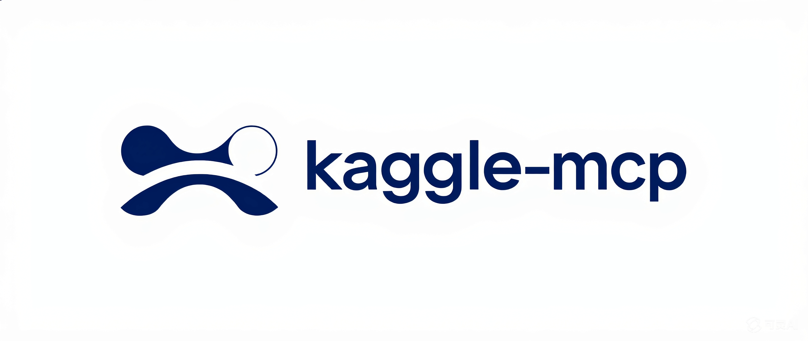
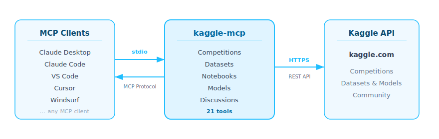

<div align="center">



<!-- mcp-name: io.github.Galaxy-Dawn/kaggle-mcp -->

A full-featured MCP server wrapping the Kaggle API — 21 tools across competitions, datasets, kernels, models, and discussions.

[](https://pypi.org/project/kaggle-mcp-server/)
[](https://opensource.org/licenses/MIT)
[](https://github.com/Galaxy-Dawn/kaggle-mcp/stargazers)
[](https://github.com/Galaxy-Dawn/kaggle-mcp/commits/master)

[English](README.md) | [中文](README.zh-CN.md)

</div>

<p align="center">
  
</p>

## Why kaggle-mcp?

Kaggle provides an [official remote MCP server](https://www.kaggle.com/docs/mcp) (`https://www.kaggle.com/mcp`). Here's how kaggle-mcp compares:

| Feature | kaggle-mcp | [Kaggle Official MCP](https://www.kaggle.com/docs/mcp) |
|---------|:----------:|:----------:|
| Total tools | **21** | ~15 |
| Discussions (search/list/detail/comments) | ✅ 4 tools | ❌ |
| Dataset creation & file upload | ✅ | ❌ |
| Architecture | Local (stdio) | Remote HTTP |
| Install | `uvx kaggle-mcp-server` | `npx mcp-remote` required |
| No remote MCP dependency | ✅ | ❌ |
| Auth | API token | OAuth 2.0 / token |

**When to use kaggle-mcp:** You need discussion tools, dataset creation/upload, or native stdio support without remote MCP dependency.

**When to use the official MCP:** You prefer OAuth 2.0 auth or want zero local installation.

## Quick Navigation

| Section | Description |
|---------|-------------|
| [Prerequisites](#prerequisites) | Kaggle API token setup |
| [Installation](#installation) | uvx / pip / source |
| [Configuration](#configuration) | Claude Desktop, Claude Code, VS Code, Cursor |
| [Tools (21)](#tools-21) | Competitions, Datasets, Kernels, Models, Discussions |
| [Debugging](#debugging) | MCP Inspector |
| [Development](#development) | Local development setup |

## Prerequisites

A Kaggle API token is required. You can authenticate using either method:

<details>
<summary><b>Option A: API Token (recommended)</b></summary>

1. Go to https://www.kaggle.com/settings → API → Create New API Token
2. Set the environment variable:

```bash
export KAGGLE_API_TOKEN="KGAT_xxxxxxxxxxxx"
```

</details>

<details>
<summary><b>Option B: kaggle.json</b></summary>

Download the token file from Kaggle settings, it will be saved to `~/.kaggle/kaggle.json`:

```json
{"username": "your_username", "key": "your_api_key"}
```

</details>

## Installation

> **Note:** MCP servers are launched automatically by MCP clients (Claude Code, VS Code, etc.) — **you don't need to run them manually in the terminal**. The commands below are what the client uses under the hood.

### Using uvx (recommended)

No installation needed. [uvx](https://docs.astral.sh/uv/guides/tools/) will automatically download and run the server:

```bash
# Used by MCP clients internally; no need to run this yourself
uvx kaggle-mcp-server
```

### Using pip

```bash
pip install kaggle-mcp-server
```

### From source

```bash
git clone https://github.com/Galaxy-Dawn/kaggle-mcp.git
cd kaggle-mcp
uv sync
```

## Configuration

### Claude Desktop

Add to your `claude_desktop_config.json`:

<details>
<summary>Using uvx (recommended)</summary>

```json
{
  "mcpServers": {
    "kaggle": {
      "command": "uvx",
      "args": ["kaggle-mcp-server"],
      "env": {
        "KAGGLE_API_TOKEN": "KGAT_xxxxxxxxxxxx"
      }
    }
  }
}
```

</details>

<details>
<summary>Using pip</summary>

```json
{
  "mcpServers": {
    "kaggle": {
      "command": "python",
      "args": ["-m", "kaggle_mcp.server"],
      "env": {
        "KAGGLE_API_TOKEN": "KGAT_xxxxxxxxxxxx"
      }
    }
  }
}
```

</details>

### Claude Code

```bash
claude mcp add kaggle -- uvx kaggle-mcp-server
```

Or add to your **project's** `.mcp.json` (not `settings.json`):

```json
{
  "mcpServers": {
    "kaggle": {
      "command": "uvx",
      "args": ["kaggle-mcp-server"],
      "env": {
        "KAGGLE_API_TOKEN": "KGAT_xxxxxxxxxxxx"
      }
    }
  }
}
```

### VS Code

[](https://vscode.dev/redirect/mcp/install?name=kaggle&config=%7B%22command%22%3A%22uvx%22%2C%22args%22%3A%5B%22kaggle-mcp-server%22%5D%7D) [](https://insiders.vscode.dev/redirect/mcp/install?name=kaggle&config=%7B%22command%22%3A%22uvx%22%2C%22args%22%3A%5B%22kaggle-mcp-server%22%5D%7D)

Add to `.vscode/mcp.json` (note: the key is **`"servers"`**, not `"mcpServers"`):

```json
{
  "servers": {
    "kaggle": {
      "command": "uvx",
      "args": ["kaggle-mcp-server"],
      "env": {
        "KAGGLE_API_TOKEN": "KGAT_xxxxxxxxxxxx"
      }
    }
  }
}
```

### Cursor

Add to `.cursor/mcp.json`:

```json
{
  "mcpServers": {
    "kaggle": {
      "command": "uvx",
      "args": ["kaggle-mcp-server"],
      "env": {
        "KAGGLE_API_TOKEN": "KGAT_xxxxxxxxxxxx"
      }
    }
  }
}
```

> **Tip:** If you already have `KAGGLE_API_TOKEN` in your **shell environment** (e.g. in `.bashrc` or `.zshrc`), you can omit the `"env"` block.

## Tools (21)

### Competitions (6)

| Tool | Description |
|------|-------------|
| `competitions_list` | Search and list Kaggle competitions |
| `competition_files` | List data files for a competition |
| `competition_download` | Download competition data files |
| `competition_submit` | Submit predictions to a competition |
| `competition_submissions` | View submission history |
| `competition_leaderboard` | View leaderboard (top 20) |

<details>
<summary>Parameter details</summary>

1. **competitions_list** — Search and list Kaggle competitions.
   - Inputs:
     - `search` (string, optional): Search term to filter competitions.
     - `category` (string, optional): Filter by category (e.g. `featured`, `research`, `playground`).
     - `sort_by` (string, optional): Sort order (`latestDeadline`, `numberOfTeams`, `recentlyCreated`).
     - `page` (integer, optional): Page number for pagination. Default `1`.
   - Returns: List of competitions with title, ref, category, deadline, and team count.

2. **competition_files** — List data files for a competition.
   - Inputs:
     - `competition` (string, required): Competition URL suffix (e.g. `titanic`).
   - Returns: List of file names and sizes.

3. **competition_download** — Download competition data files. Returns download URL.
   - Inputs:
     - `competition` (string, required): Competition URL suffix.
     - `file_name` (string, optional): Specific file to download. Empty for all files.
   - Returns: Download URL.

4. **competition_submit** — Submit predictions to a competition.
   - Inputs:
     - `competition` (string, required): Competition URL suffix.
     - `blob_file_tokens` (string, required): Blob file token from upload.
     - `message` (string, required): Submission description message.
   - Returns: Submission result details.

5. **competition_submissions** — View submission history for a competition.
   - Inputs:
     - `competition` (string, required): Competition URL suffix.
   - Returns: List of submissions with date, score, status, and description.

6. **competition_leaderboard** — View competition leaderboard (top 20).
   - Inputs:
     - `competition` (string, required): Competition URL suffix.
   - Returns: Top 20 team names and scores.

</details>

### Datasets (6)

| Tool | Description |
|------|-------------|
| `datasets_list` | Search and list Kaggle datasets |
| `dataset_files` | List files in a dataset |
| `dataset_download` | Download dataset files |
| `dataset_metadata` | Get dataset metadata |
| `dataset_create` | Create a new dataset |
| `file_upload` | Upload a file to Kaggle |

<details>
<summary>Parameter details</summary>

1. **datasets_list** — Search and list Kaggle datasets.
   - Inputs:
     - `search` (string, optional): Search term.
     - `sort_by` (string, optional): Sort order (`hottest`, `votes`, `updated`, `active`).
     - `file_type` (string, optional): Filter by file type (`csv`, `json`, `sqlite`, etc).
     - `page` (integer, optional): Page number. Default `1`.
   - Returns: List of datasets with title, ref, size, and download count.

2. **dataset_files** — List files in a dataset.
   - Inputs:
     - `owner` (string, required): Dataset owner username.
     - `dataset_slug` (string, required): Dataset slug name.
   - Returns: List of file names and sizes.

3. **dataset_download** — Download dataset files. Returns download URL.
   - Inputs:
     - `owner` (string, required): Dataset owner username.
     - `dataset_slug` (string, required): Dataset slug name.
     - `file_name` (string, optional): Specific file. Empty for all.
   - Returns: Download URL.

4. **dataset_metadata** — Get dataset metadata.
   - Inputs:
     - `owner` (string, required): Dataset owner username.
     - `dataset_slug` (string, required): Dataset slug name.
   - Returns: Dataset metadata dictionary.

5. **dataset_create** — Create a new dataset. Use `file_upload` first to get file tokens.
   - Inputs:
     - `owner` (string, required): Owner username.
     - `slug` (string, required): Dataset slug.
     - `title` (string, required): Dataset title.
     - `file_tokens` (string, optional): Comma-separated file tokens from `file_upload`.
     - `license_name` (string, optional): License (e.g. `CC0-1.0`, `CC-BY-SA-4.0`). Default `CC0-1.0`.
     - `is_private` (boolean, optional): Whether dataset is private. Default `true`.
   - Returns: Creation result details.

6. **file_upload** — Upload a file to Kaggle and get a token for `dataset_create`.
   - Inputs:
     - `file_name` (string, required): File name (e.g. `data.csv`, `config.json`).
     - `content` (string, required): File content as text.
   - Returns: File token string.

</details>

### Kernels (3)

| Tool | Description |
|------|-------------|
| `kernels_list` | Search and list notebooks/kernels |
| `kernel_pull` | Get a notebook's source code |
| `kernel_push` | Push/save a notebook to Kaggle |

<details>
<summary>Parameter details</summary>

1. **kernels_list** — Search and list Kaggle notebooks/kernels.
   - Inputs:
     - `search` (string, optional): Search term.
     - `competition` (string, optional): Filter by competition.
     - `dataset` (string, optional): Filter by dataset.
     - `sort_by` (string, optional): Sort order (`hotness`, `commentCount`, `dateCreated`, `dateRun`, `relevance`, `voteCount`).
     - `page` (integer, optional): Page number. Default `1`.
   - Returns: List of kernels with title, ref, votes, and language.

2. **kernel_pull** — Get a notebook's source code.
   - Inputs:
     - `user_name` (string, required): Kernel owner username.
     - `kernel_slug` (string, required): Kernel slug name.
   - Returns: Kernel metadata and source code.

3. **kernel_push** — Push/save a notebook to Kaggle.
   - Inputs:
     - `title` (string, required): Notebook title.
     - `text` (string, required): Notebook source code.
     - `language` (string, optional): Language (`python`, `r`). Default `python`.
     - `kernel_type` (string, optional): Type (`notebook`, `script`). Default `notebook`.
     - `is_private` (boolean, optional): Whether notebook is private. Default `true`.
   - Returns: Push result details.

</details>

### Models (2)

| Tool | Description |
|------|-------------|
| `models_list` | Search and list Kaggle models |
| `model_get` | Get detailed model information |

<details>
<summary>Parameter details</summary>

1. **models_list** — Search and list Kaggle models.
   - Inputs:
     - `search` (string, optional): Search term.
     - `owner` (string, optional): Filter by owner.
     - `sort_by` (string, optional): Sort order (`hotness`, `downloadCount`, `createTime`, `updateTime`).
     - `page_size` (integer, optional): Number of results per page. Default `20`.
   - Returns: List of models with title and ref.

2. **model_get** — Get detailed information about a specific model.
   - Inputs:
     - `owner` (string, required): Model owner username.
     - `model_slug` (string, required): Model slug/name.
   - Returns: Model metadata dictionary.

</details>

### Discussions (4)

| Tool | Description |
|------|-------------|
| `discussions_search` | Search Kaggle discussions |
| `discussions_list` | List discussions for a competition/dataset |
| `discussion_detail` | Get discussion content by ID |
| `discussion_comments` | Get comments for a discussion |

<details>
<summary>Parameter details</summary>

1. **discussions_search** — Search Kaggle discussions.
   - Inputs:
     - `query` (string, required): Search query string.
     - `page_size` (integer, optional): Number of results (max 50). Default `20`.
   - Returns: List of discussions with ID, title, and votes.

2. **discussions_list** — List discussions for a competition or dataset.
   - Inputs:
     - `competition` (string, optional): Competition slug to filter.
     - `dataset` (string, optional): Dataset ref to filter.
     - `page_size` (integer, optional): Number of results (max 50). Default `20`.
   - Returns: List of discussions with ID, title, and votes.

3. **discussion_detail** — Get discussion content by ID.
   - Inputs:
     - `discussion_id` (integer, required): Numeric discussion ID.
   - Returns: Discussion title, author, votes, forum, and body content.

4. **discussion_comments** — Get comments for a discussion.
   - Inputs:
     - `discussion_id` (integer, required): Numeric discussion ID.
   - Returns: Link to discussion comments page.

</details>

## Debugging

You can use the [MCP Inspector](https://modelcontextprotocol.io/docs/tools/inspector) to debug the server:

```bash
npx @modelcontextprotocol/inspector uvx kaggle-mcp-server
```

The Inspector will provide a URL to access debugging tools in your browser.

## Development

```bash
git clone https://github.com/Galaxy-Dawn/kaggle-mcp.git
cd kaggle-mcp
uv sync
```

Then configure the server in your MCP client using the local path, or test with [MCP Inspector](#debugging).

## Contributing

Contributions are welcome! Please open an issue or submit a pull request on the [GitHub repository](https://github.com/Galaxy-Dawn/kaggle-mcp).

## License

This project is licensed under the MIT License. See the [LICENSE](LICENSE) file for details.
